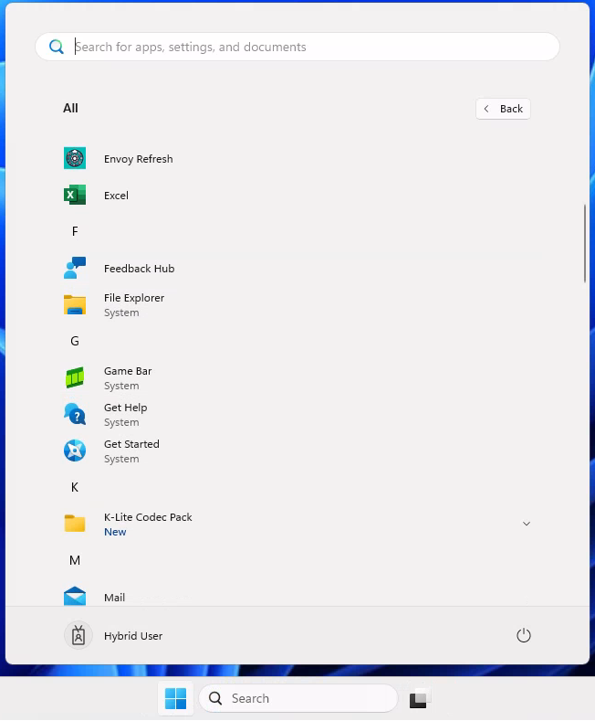
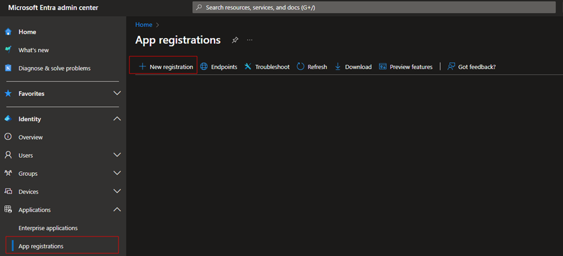
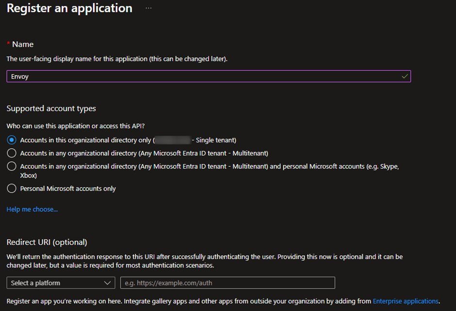
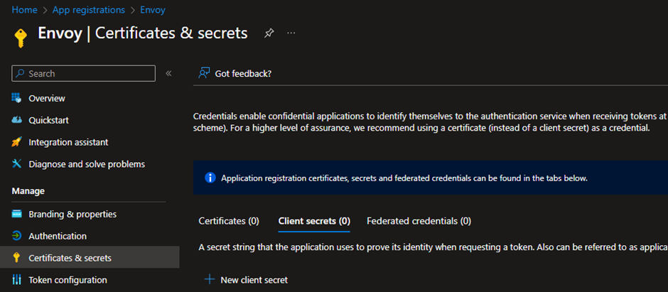
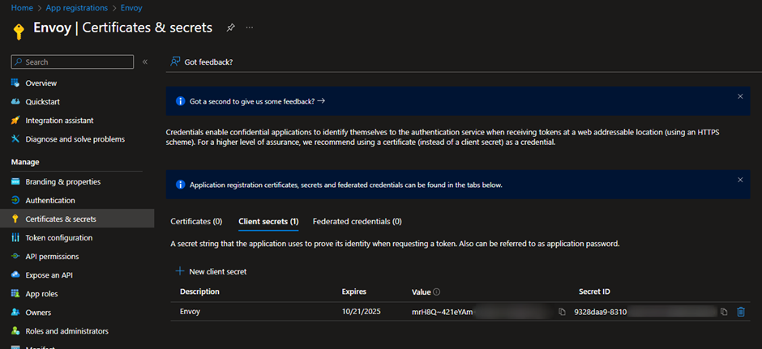
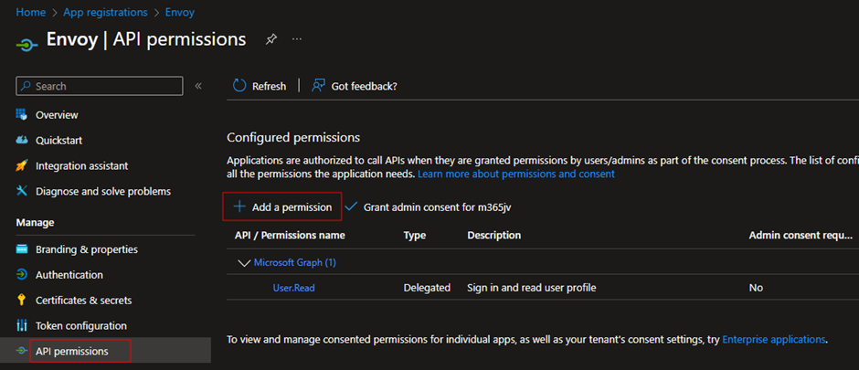

# ENVOY - Lightweight User Environment Manager

This tool automates the deployment or execution of configurations during logon on Windows machines. It is mainly built for Intune Managed devices where certain actions are not natively possible from Intune. During execution it connects to Microsoft Graph using an App Registration and grabs the group memberships from the user. The script performs tasks such as drive mapping, printer mapping, registry key management, File Actions (copy/move/delete/rename) and starts executables based on Entra ID group membership.


 - 🌐 https://www.envoycontrol.com
 - ✉️ info@envoycontrol.com


&nbsp;

# 📺 Demo

Watch the video on Youtube

[](https://www.youtube.com/watch?v=HaOsP7huuDw)


&nbsp;

# 📑 Contents
- [ENVOY - Lightweight User Environment Manager](#envoy---lightweight-user-environment-manager)
- [📺 Demo](#-demo)
- [📑 Contents](#-contents)
- [🚀 Core Components](#-core-components)
- [🔜 Roadmap](#-roadmap)
- [🚧 Release Notes](#-release-notes)
- [💥 Functions](#-functions)
    - [📰 Write-Log](#-write-log)
    - [📁 Deploy-DriveMappings](#-deploy-drivemappings)
    - [📘 Deploy-RegistryKeys](#-deploy-registrykeys)
    - [⏳ Deploy-Executables](#-deploy-executables)
    - [💾 Deploy-FileActions](#-deploy-fileactions)
    - [📠 Deploy-Printers](#-deploy-printers)
  - [✅ Execution](#-execution)
  - [✅ Delayed Execution](#-delayed-execution)
  - [🔃 Envoy Refresh](#-envoy-refresh)
  - [⚠️ Dependencies](#️-dependencies)
- [💻 Installation](#-installation)
  - [App registration](#app-registration)
  - [Install Envoy](#install-envoy)
  - [Configure Envoy](#configure-envoy)
  - [Centralized distribution](#centralized-distribution)
    - [GitHub-Hosted Config Delivery](#github-hosted-config-delivery)
    - [Azure Blob](#azure-blob)
    - [Azure Files](#azure-files)
    - [File Share (on-prem)](#file-share-on-prem)


&nbsp;

# 🚀 Core Components

- **Microsoft Graph Authentication**: The script uses the `Microsoft.Graph` modules to interact with Microsoft Graph APIs.
- **Configuration File**: Reads settings from `Config.json` located at `C:\ProgramData\Envoy\Config.json`.
- **Authentication**: Connects to Microsoft Graph using `TenantId`, `AppId`, and `AppSecret` from the configuration file.

&nbsp;

# 🔜 Roadmap
- Migrate App Registration secret to a more robust authentication method
- Getting rid of vbscript to run a PS completely hidden.
- Adding FileTypeAssociations function (except for HTTP/HTTPS/PDF)

&nbsp;

# 🚧 Release Notes
- 1.1.116: Adding an option to set specific printer as the default printer

&nbsp;

# 💥 Functions

### 📰 Write-Log

- **Purpose:** Logs messages to a user-specific log file located at `C:\ProgramData\Envoy\Logging\<username>\User.log`.

- **Key Features:** Ensures the log directory exists and appends timestamped log entries.

&nbsp;

### 📁 Deploy-DriveMappings

**Purpose**: Maps or removes network drives based on configuration.

**Key Features:**
  - Reads drive mapping configurations from `Config.json`.
  - Checks user group memberships to determine eligibility.
  - Supports adding and removing drive mappings.
  - Logs success or failure of each operation.
  - Priority handling for situations with conflicting actions (e.g. same drive letters).

&nbsp;

**Example:**
```
"Drives": [
      {
        "DriveLetter": "X",
        "UNCPath": "\\\\storageaccount.file.core.windows.net\\share1",
        "Group": "GG - Share 1",
        "Description": "Test Drive",
        "Priority": 1,
        "Action": "add"
      },
      {
        "DriveLetter": "Y",
        "UNCPath": "\\\\fileserver\\share2",
        "Group": "GG - Share 2",
        "Description": "Test Drive 2",
        "Priority": 1,
        "Action": "add"
      }
    ],
```

**Usage:**
| Setting           | Values      | Description  |
|------------------|-----|-----------------------|
| DriveLetter      | x,y,z, etc.  | Configure the desired drive mapping letter.                   |
| UNCPath           |\\\\server.domain.local\\share  | Configure the desired UNC path. Don't forget double slashes for JSON |
| Group | e.g. "GG - Sales Team" | Configure the desired Entra ID group. Users in this group will receive this drive mapping. Leave the group empty for "everyone". |
| Description | Text | Fill in a description. E.g. Sales Drive, Markering Team. |
| Priority | 1,2,3,4,5,6, etc | Conflicts with drive mappings can occur if a user is a member of multiple groups with the same drive letter as result. |Prio 1 is the lowest, higher winns. |
| Action | Add or Remove | Define the action for the drive mapping |

&nbsp;

### 📘 Deploy-RegistryKeys

**Purpose:**  Adds or removes registry keys based on configuration.

**Key Features:**
  - Reads registry configurations from `Config.json`.
  - Checks user group memberships to determine eligibility.
  - Ensures registry keys exist before setting values.
  - Supports adding and removing registry keys.
  - Logs success or failure of each operation.

&nbsp;

**Example:**
```
    "Registries": [
      {
        "Key": "HKCU:\\Software\\TestKey",
        "ValueName": "TestValue1",
        "ValueType": "DWORD",
        "ValueData": 1,
        "Group": "GG - Registry - TestKey",
        "Action": "add"
      },
      {
        "Key": "HKCU:\\Software\\TestKey",
        "ValueName": "TestValue2",
        "ValueType": "STRING",
        "ValueData": "2",
        "Group": "",
        "Action": "add"
      }
    ],
```

**Usage:**
| Setting           | Values      | Description  |
|------------------|-----|-----------------------|
| Key | HKCU:\\Path\\ | Fill in the desired HKCU Path |
| ValueName | Text | Fill in the desired value name |
| ValueType | DWORD, STRING, etc | Define the desired type |
| ValueData | Data | Define the desired data. Decimal, text, path's, etc. |
| Group | e.g. "GG - Sales Team" | Configure the desired Entra ID group. Users in this group will receive this registry setting. Leave the group empty for "everyone". |
| Action | Add or Remove | Define the action for the registry key |

&nbsp;

### ⏳ Deploy-Executables

**Purpose:** Starts executables with optional arguments based on configuration.

**Key Features:**
  - Reads executable configurations from `Config.json`.
  - Checks user group memberships to determine eligibility.
  - Supports starting executables with or without arguments.
  - Logs success or failure of each operation.

&nbsp;
**Example:**
```
    "Executables": [
      {
        "FilePath": "C:\\ProgramFiles\\CustomApp\\Setup.msi",
        "Arguments": "/qn",
        "Group": "GG - Custom App"
      },
      {
        "FilePath": "C:\\Windows\\System32\\calc.exe",
        "Arguments": "",
        "Group": "GG - Calculator"
      }
    ],
```

&nbsp;

**Usage:**
| Setting           | Values      | Description  |
|------------------|-----|-----------------------|
| FilePath | C:\Folder\File.exe | Configure the file path |
| Arguments | /qn, /silent, etc | Supports arguments belonging to the application |
| Group | e.g. "GG - Sales Team" | Configure the desired Entra ID group. Users in this group will automatically launch the configured application. Leave the group empty for "everyone". |

&nbsp;

### 💾 Deploy-FileActions

**Purpose:** Performs file operations (copy, delete, rename, move) based on configuration.

**Key Features:**
  - Reads file action configurations from `Config.json`.
  - Checks user group memberships to determine eligibility.
  - Supports the following actions:
    - Copy: Copies files to a destination.
    - Delete: Deletes files.
    - Rename: Renames files.
    - Move: Moves files to a new location.
  - Logs success or failure of each operation.

&nbsp;

**Example:**
```
    "FileActions": [
      {
        "FileActionType": "copy",
        "SourcePath": "C:\\Temp\\Source\\File.txt",
        "DestinationPath": "C:\\Temp\\Destination\\File.txt",
        "NewName": "NewFileName.txt",
        "Group": "GG - FileAction - Copy"
      },
      {
        "FileActionType": "rename",
        "SourcePath": "C:\\Temp\\Source\\File.txt",
        "DestinationPath": "C:\\Temp\\Destination\\File.txt",
        "NewName": "NewFileName.txt",
        "Group": "GG - FileAction - Rename"
      },
      {
        "FileActionType": "move",
        "SourcePath": "C:\\Temp\\Source\\File.txt",
        "DestinationPath": "C:\\Temp\\Destination\\File.txt",
        "NewName": "NewFileName.txt",
        "Group": "GG - FileAction - Move"
      },
      {
        "FileActionType": "delete",
        "SourcePath": "C:\\Temp\\Source\\File.txt",
        "DestinationPath": "C:\\Temp\\Destination\\File.txt",
        "NewName": "NewFileName.txt",
        "Group": "GG - FileAction - Delete"
      }
    ],
```

**Usage:**
| Setting           | Values      | Description  |
|------------------|-----|-----------------------|
| FileActionType | copy, rename, move, delete | Configure the file action |
| SourcePath | C:\Folder\Source\File.ini | Being used for actions: copy, rename, move, delete |
| DestinationPath | C:\Folder\Destination\File.ini | Being used for actions: copy, move |
| NewName | FileName | Set the desired new file name. Being used for actions: rename |
| Group | e.g. "GG - Sales Team" | Configure the desired Entra ID group. Users in this group will automatically execute the file actions. Leave the group empty for "everyone". |

&nbsp;

### 📠 Deploy-Printers

**Purpose:** Adds or removes printers based on configuration.

**Key Features:**
  - Reads printer configurations from `Config.json`.
  - Checks user group memberships to determine eligibility.
  - Supports adding and removing printers.
  - Logs success or failure of each operation.

&nbsp;
**Example:**
```
    "Printers": [
      {
        "PrinterPath": "\\\\PRINTSRV.domain.local\\FollowMe",
        "Group": "GG - Printers - FollowMe",
        "Action": "add",
        "DefaultPrinter": "True"
      },
      {
        "PrinterPath": "\\\\PRINTSRV.domain.local\\PRT01",
        "Group": "",
        "Action": "remove"
      }
    ]
```
**Usage:**
| Setting           | Values      | Description  |
|------------------|-----|-----------------------|
| PrinterPath | \\\\server\\printer | Configure the UNC path for the desired printer |
| Group | e.g. "GG - Sales Team" | Configure the desired Entra ID group. Users in this group will automatically add or remove the printer queue. Leave the group empty for "everyone". |
| Action | Add or Remove | Define if the printer queue should be added or removed |
| DefaultPrinter | True | Sets the specified printer queue as the default printer in Windows. If this value is empty or set to False, no action is taken. If multiple printer queues are marked as default in the configuration, the last one listed will be applied as the default printer. |


&nbsp;

## ✅ Execution

The script executes the following tasks sequentially while logging on. The scheduled task created by `Envoy.msi` will execute these functions.

1. **Drive Mapping**: Execute `Deploy-DriveMappings` to manage network drives.
2. **Registry Key Management**: Execute `Deploy-RegistryKeys` to manage registry keys.
3. **Process execution**: Execute `Deploy-ProcessExecution` to manage process executions.
4. **File Actions**: Execute `Deploy-FileActions` to manage file actions.
5. **Printer mapping**: Execute `Deploy-PrinterMappings` to manage printer mappings.
6. **All functions**: Execute `Invoke-UEMDeployment` to manage all functions at once.

&nbsp;

## ✅ Delayed Execution


If you need to implement a delayed execution in your environment, you can customize the code accordingly. Locate `$delaySeconds` in the `Envoy-logon.ps1` file. Set the desired delay and remove any hashtags associated with the delay (which is disabled by default).

&nbsp;

## 🔃 Envoy Refresh

Configurations can be refreshed during an active user session. A shortcut in the public start menu allows you to re-launch Envoy. All configurations will be reassessed and executed by referencing the Config.JSON file.



## ⚠️ Dependencies

Requires the following PowerShell modules. Installation will be handled by the MSI installer. If required modules are already installed it will skip the installation. Otherwise it will download and install the latest version of these modules.

- `Microsoft.Graph.Authentication`
- `Microsoft.Graph.Groups`
- `Microsoft.Graph.Users`

&nbsp;

# 💻 Installation

Complete the following steps to set up Envoy correctly in your environment.

## App registration

Envoy retrieves user and group membership information from Microsoft Entra ID via Microsoft Graph. It uses the Microsoft.Graph.Authentication, Microsoft.Graph.Groups, and Microsoft.Graph.Users modules to access and query directory data. Envoy requires an App Registration with the appropriate Graph API permissions. Authentication credentials (*including the Client ID, Tenant ID, and Client Secret*) are stored in the `Config.json` file, enabling automated access to Entra ID for reporting or auditing purposes.

> [!IMPORTANT]
> The `Config.json` file is stored locally on the device. As a result, anyone with access to the file’s location can potentially view the Client ID and Secret. To mitigate this risk, it is essential to grant the App Registration only the minimum required permissions.

**1. Create the App registration:** Go to https://entra.microsoft.com/ -> Identity -> Applications -> App registrations -> New registration.



**2. Fill in the desired App registration name:** For example Envoy. Select Single tenant and click Create.



**3. Click on New client secret:** Fill in the desired name and an required secret lifetime.



**4. Write down the following information:**

  -	Secret ID
  -	Value
  -	Application ID



**5. Set required API permissions:** Microsoft Graph
  -	Group.Read.All (Application)
  -	GroupMember.Read.All (Application)
  -	User.Read (Delegated)
  -	User.Read.All (Application)



## Install Envoy
Visit the official releases page: 👉 https://github.com/j0eyv/Envoy/releases

Look for the latest release at the top of the page (marked with a “Latest” label). Under the Assets section of that release, click the .msi file (e.g., Envoy.msi) to download the Windows installer. Once downloaded, distribute the MSI installation to your managed endpoints.

> [!IMPORTANT]
> The installation **must** be installed in `C:\ProgramData\Envoy`. Using a different location might break the entire product.

The installation process is simple—just run the MSI file manually to start the setup. For bulk or unattended deployments, it's recommended to use silent installation parameters for automation. Therefor, use `msiexec /i "C:\Path\To\Envoy.msi" /qn /norestart`. While using **Intune**, you can simply distribute Envoy via the available methods.

- `/i Envoy.msi`: Installs the MSI package named Envoy.msi.
- `/qn`: Quiet mode with no UI.
- `/norestart`: Prevents the installer from restarting the system.

## Configure Envoy

Once distributed, we only need to make sure the `Config.JSON` file is being used is filled correctly. The default config file that comes with the installation is mainly filled with examples. Important part of the `Config.JSON` file is the tenant configuration. Make sure the Entra ID configuration matches the newly created App registration from the steps before. We **DO** need the the following information:

```
  "Configuration": {
    "Entra": {
      "TenantId": "42ba3ed1-ae78-****-****-************",
      "AppId": "aed0ab9a-963e-****-****-***********",
      "AppSecret": "0d08Q~uOmVlERx_***************-"
    },
```

See the the detailed [documentation](#-functions) for configuration examples.

&nbsp;

## Centralized distribution

There are several ways to manage and distribute a centralized `Config.JSON`, and the best approach depends entirely on your existing infrastructure and the tools it supports. Unfortunately, there’s no universal solution that satisfies all use cases and security best practices. Therefore, we provide a few potential options that you will need to implement yourself. It's important to evaluate each option carefully, as some may have limitations or may not fully align with recommended security practices.

### GitHub-Hosted Config Delivery
This method stores a Config.JSON file in a private GitHub repository. Windows clients securely download this file on a schedule using PowerShell and a GitHub Personal Access Token (PAT) for authentication.

- ✅ Secure storage in a private repo
- 🔐 Access controlled via read-only PAT
- ⏰ Automated 15-minute interval download using a Scheduled Task
- 🛠️ Script uses Invoke-WebRequest with the raw.githubusercontent.com endpoint

A scheduled task for this method is delivered with the Envoy.MSI installation file. You are required to configure a few parameters within `C:\ProgramData\Envoy\Core\Update\Download-EnvoyConfig-Github.ps1`. Find a way to distribute this PowerShell script into your endpoints.

> [!NOTE]
> This method requires you to create a private Github repo with a Personal Access Token (PAT). See this link for more information: https://docs.github.com/en/authentication/keeping-your-account-and-data-secure/managing-your-personal-access-tokens

### Azure Blob

This method stores a Config.JSON file in a Azure Blob container. Windows clients securely download this file on a schedule using PowerShell.

- ✅ Secure storage in a Azure Blob container
- ⏰ Automated 15-minute interval download using a Scheduled Task
- 🛠️ Script uses Invoke-WebRequest with the blob.core.windows.net endpoint

A scheduled task for this method is delivered with the Envoy.MSI installation file. You are required to configure a single parameters within `C:\ProgramData\Envoy\Core\Update\Download-EnvoyConfig-Blob.ps1`. Find a way to distribute this PowerShell script into your endpoints.

> [!NOTE]
> This method requires you to create a Azure Blob storage within a Storage Account. The endpoint running Envoy, should have read access to the blob storage. Try accessing the URL from a browser in the endpoint to verify if access is allowed. See this link for more information: https://learn.microsoft.com/en-us/azure/storage/common/storage-account-create?tabs=azure-portal

### Azure Files

This method stores a Config.JSON file in a Azure File Share. Windows clients securely download this file on a schedule using PowerShell.

- ✅ Secure storage in a Azure File Share
- 🔐 Access controlled via Storage Account key (less recommended)
- ⏰ Automated 15-minute interval download using a Scheduled Task
- 🛠️ Script uses Invoke-WebRequest with the file.core.windows.net endpoint

A scheduled task for this method is delivered with the Envoy.MSI installation file. You are required to configure a few parameters within `C:\ProgramData\Envoy\Core\Update\Download-EnvoyConfig-AzureFiles.ps1`. Find a way to distribute this PowerShell script into your endpoints.

> [!NOTE]
> This method requires you to create a Azure File Share within a Storage Account. The endpoint running Envoy, should be able to reach the file share. See this link for more information: https://learn.microsoft.com/en-us/azure/storage/files/storage-how-to-use-files-portal?tabs=azure-portal

### File Share (on-prem)
This method stores a Config.JSON file in a regular File Share. Windows clients securely download this file on a schedule using PowerShell.

- ✅ Secure storage in a File Share
- 🔐 Access controlled via NTFS permissions
- ⏰ Automated 15-minute interval download using a Scheduled Task
- 🛠️ Scheduled Task should be configured to run under a service account

A scheduled task for this method is delivered with the Envoy.MSI installation file. You are required to configure a few parameters within `C:\ProgramData\Envoy\Core\Update\Download-EnvoyConfig-FileShare.ps1`. The scheduled task should run under a service account which needs to be configured by yourself in the scheduled task. Find a way to distribute this PowerShell script and the fully configured scheduled task into your endpoints.
