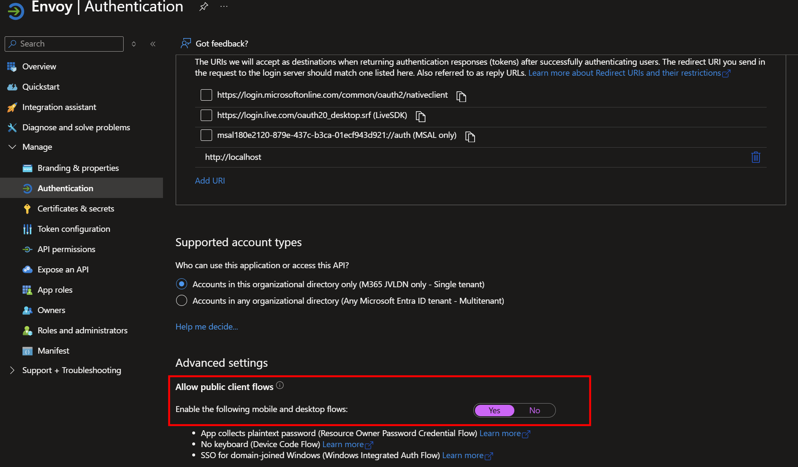
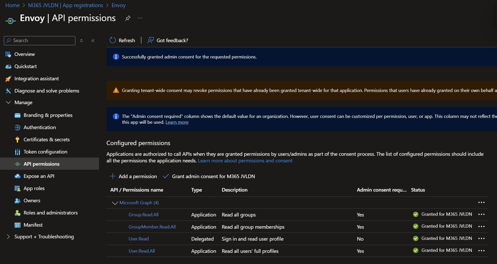
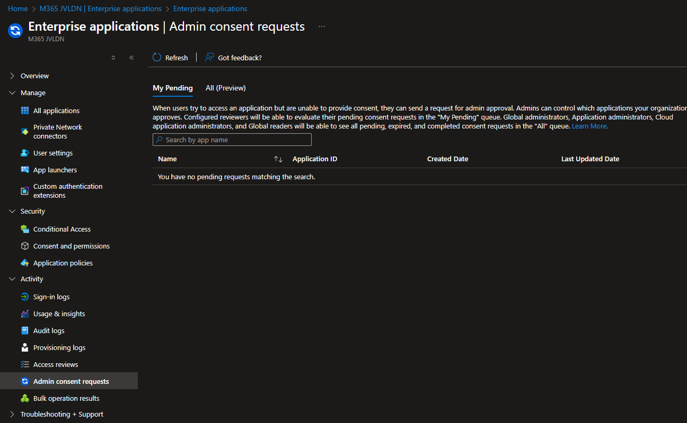

# ENVOY - Lightweight User Environment Manager

> [!IMPORTANT]
> If you are upgrading from version 1.2.* to 1.3.*, please be aware that this release introduces breaking changes if not followed correctly!

Starting with version 1.3.*, Envoy utilizes an App Registration along with **Application Permissions**. It no longer relies on the public **Microsoft Graph Command Line Tools** Enterprise App. The MG Graph CLI will be discontinued in 2026!


## App registration

Envoy retrieves user and group membership information from Microsoft Entra ID via Microsoft Graph. It uses the Microsoft.Graph.Authentication, Microsoft.Graph.Groups, and Microsoft.Graph.Users modules to access and query directory data. Envoy requires an App Registration with the appropriate Graph API permissions.

**1. Create the App registration:** Go to https://entra.microsoft.com/ -> Identity -> Applications -> App registrations -> New registration.


**2. Fill in the desired App registration name:** For example Envoy. Select Single tenant and configure a redirect URI (http://localhost). Finally click Create.


**3. Enable Public Client flows:** Make sure to enable Public client flows.



**4. Set required API permissions:** Microsoft Graph
  -	Group.Read.All (Application)
  -	GroupMember.Read.All (Application)
  -	User.Read (Delegated)
  -	User.Read.All (Application)

  Make sure to **Grant admin consent**.




**Manual trigger:**

Option 1: When Envoy is launched from a test or admin machine, an interactive permission prompt will automatically appear. These permissions must be granted for proper functionality.

Option 2: Run the command below from a test or admin device to authenticate with Microsoft Graph. Ensure your account has the necessary Entra ID permissions, such as Application Administrator. Fill in the ClientId from the App Registration and TenantId.

```
# Install and Import required modules
"Microsoft.Graph.Authentication", "Microsoft.Graph.Groups", "Microsoft.Graph.Users" | ForEach-Object {
    if (-not (Get-Module -ListAvailable -Name $_)) { Install-Module -Name $_ -Scope CurrentUser -Force -AllowClobber }
    Import-Module $_
}

# Connect to Entra ID using Microsoft Graph delegated permissions
Connect-MgGraph -ClientId "eccfcb90-****-****-*********" -TenantId "42ba3ed1-a****-****-*************" -Scopes "User.Read.All","Group.Read.All","GroupMember.Read.All" -NoWelcome
```

This will result in the following Interactive popup. Accept the permissions and grant admin consent.


Additionally, you can approve requested permissions in **Admin consent requests**.



## Implementation/testing
1. Create the App registration with required permissions. Give admin consent
2. Tigger an authentication to MgGraph. Accept required permissions
3. Install the newest Envoy.MSI installer (only on your test device, first)
4. Modify the `Config.JSON` file so it includes TenantId and AppId parameters under Tenant section.
